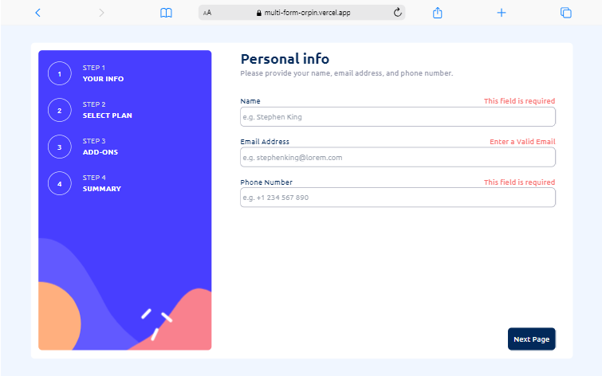
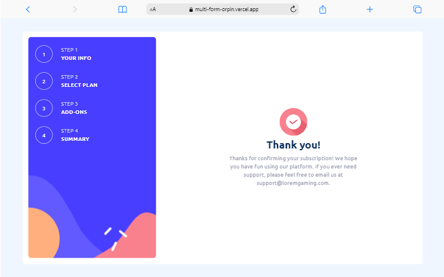
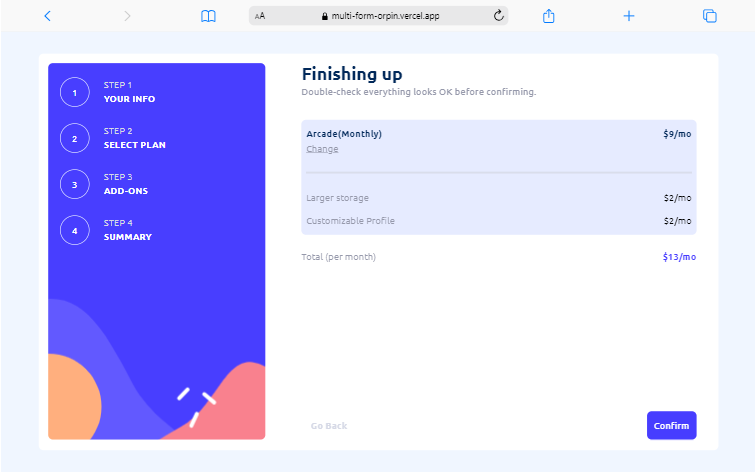
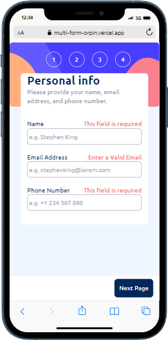
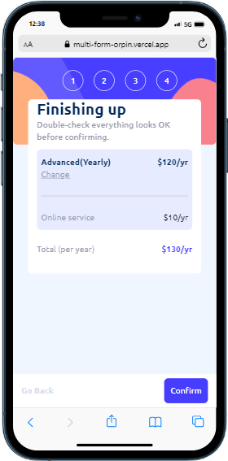

# Frontend Mentor - Multi-step form solution

This is a solution to the [Multi-step form challenge on Frontend Mentor](https://www.frontendmentor.io/challenges/multistep-form-YVAnSdqQBJ). Frontend Mentor challenges help you improve your coding skills by building realistic projects.

## Table of contents

- [Overview](#overview)
  - [The challenge](#the-challenge)
  - [Screenshot](#screenshot)
  - [Links](#links)
- [My process](#my-process)
  - [Built with](#built-with)
  - [What I learned](#what-i-learned)
  - [Continued development](#continued-development)
  - [Useful resources](#useful-resources)
- [Author](#author)

## Overview

This is a multistep form built with react to showcase my knowledge and skill.

### The challenge

Users should be able to:

- Complete each step of the sequence
- Go back to a previous step to update their selections
- See a summary of their selections on the final step and confirm their order
- View the optimal layout for the interface depending on their device's screen size
- See hover and focus states for all interactive elements on the page
- Receive form validation messages if:
  - A field has been missed
  - The email address is not formatted correctly
  - A step is submitted, but no selection has been made

### Screenshot











### Links

- Solution URL: [LINK TO REPO](https://github.com/NICKY-TECH/MULTI-FORM)
- Live Site URL: [HOSTED SITE](https://multi-form-orpin.vercel.app/)

## My process

The project was quite insightful as I had to think about the workflow and make some reseach at the occurrence of errors.
My process workflow is summarized below:

1. I created the project
2. I added project requirements
3. I initialized git
4. I commenced the creation of each page without adding the functionalities; I focused on the design and responsiveness.
5. I commenced the addition of functionalities for each page.
6. I uploaded the project
7. Fixed project bugs
8. Add readme.md
9. Final push

### Built with

- Flexbox
- CSS Grid
- [Redux](https://redux.js.org/) - React package
- [React](https://reactjs.org/) - JS library
- [Tailwind](https://tailwindcss.com/docs/installation) - CSS Framework
- [Typescript for React](https://react.dev/learn/typescript) - For enforcing data types

### What I learned

During the implementation of this project I learnt about Typescript and how to use it within a react project. Typescript is cool and I plan on using it more often.

The code below shows the use of typescript:

```js
const selectedBox: {
  title: string | undefined,
  amount: number | undefined,
  type: string,
} = {
  title: titleRef.current?.innerHTML,
  amount:
    selectedPlan === "Monthly"
      ? numericAmount?.amountMonthly
      : numericAmount?.amountYearly,
  type: selectedPlan,
};
```

### Continued development

I want to continue learning about typescript

### Useful resources

- [Typescript](https://www.w3schools.com/typescript/) - This resource will aid you in learning typescript

## Author

- Github- [NICKY-TECH](https://github.com/NICKY-TECH)
